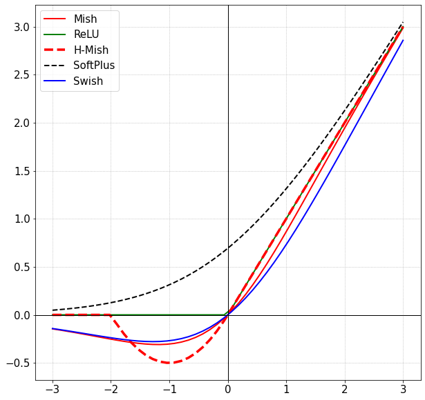

# HardMish
Tensorflow Implementation of Hard Mish - Memory Efficient and faster equivalent of Mish

Formula - *(x/2).min(2, max(0, x+2))*

```python
import tensorflow as tf
def hard_mish(x):
    return tf.minimum(2., tf.nn.relu(x + 2.)) * 0.5 * x
```
 
<div style="text-align:center"></div>
<p>
    <em>Figure 1. Hard Mish Activation Function</em>
</p>

### CIFAR-10: 

|Architecture|Swish|H-Mish|Mish|ReLU|
|:---:|:---:|:---:|:---:|:---:|
|ResNet-20|90.42%|92.57%|**92.68%**|91.8%|


## References 
- [H-Mish](https://github.com/digantamisra98/H-Mish)